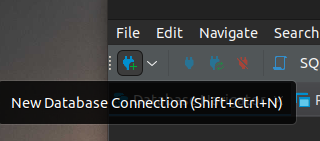
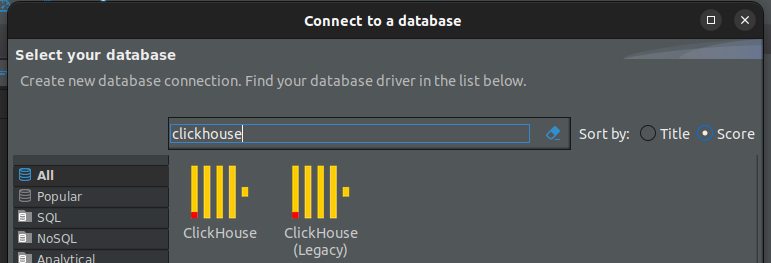
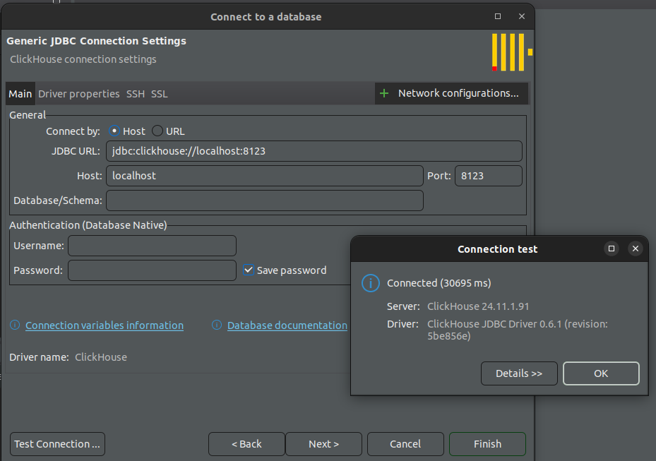
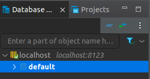
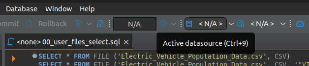

# How to use ClickHouse to do quick adhoc file analysis

Walkthrough to get ClickHouse server running on your local machine and use DBeaver as a client to query csv/parquet files.  There is a bash script here that you can run that will generate the select statements for your files to quickly get you analysing data.

These instuctions are for MacOS

## Some Links
- ClickHouse quick start - https://clickhouse.com/clickhouse#getting_started
- ClickHouse quick install - https://clickhouse.com/docs/en/install
- ClickHouse file table function - https://clickhouse.com/docs/en/sql-reference/table-functions/file
- DBeaver Community - https://dbeaver.io/download/

## ClickHouse setup
Open a terminal and run this:
```
mkdir clickhouse
cd clickhouse
curl https://clickhouse.com/ | sh
```
Then run the following commmand:
```
./clickhouse server
```

ClickHouse server is now running on your local machine.

## DBeaver setup
Browse to https://dbeaver.io/download/ and following the install instuctions for your OS.

Open DBeaver and click add connection icon from the tool bar:



Filter for ClickHouse, pick the first one(not Legacy):



Leave the default connection parameters and click **Test Connection**. Then **OK** then **Finish**:



You should now have a localhost connection in the left panel with a default database:



## DBeaver slow to connect
If DBeaver is slow to connect copy the `config.d` folder from this repo into your ClickHouse install directory and restart ClickHouse.  This will override the `http_max_tries` parameter. Newer versions of ClickHouse have a default of 10.  You'll see in the logs the following 10 times as it keeps retrying:
```
<Debug> ReadWriteBufferFromHTTP: Failed to make request to 'http://127.0.0.1:9019/ping?use_connection_pooling=1'. Error: 'Connection refused'
```
I googled and researched and couldn't find what or why there is that error. I found the parameter `http_max_tries` setting to 1 stops it from being annoying.

## user_files
Go to the directory where ClickHouse was installed and you will see a sub-directory called `user_files`.  Copy the 4 files from the `user_files` directory from this repo into the `user_files` directory where ClickHouse was installed on your machine.

* `00_generate_select.command` - Bash script that when executed creates select statements for all the files located in that user_files directory and puts those in a file called `00_user_files_select.sql`.  Additional details below.
* `Electric_Vehicle_Population_Data.csv` - Is a copy of the csv from https://catalog.data.gov/dataset/electric-vehicle-population-data.  
* `states.csv` - List of US state abbreviations and names
* `flights-1m.parquet` - Sample parquet file from https://www.tablab.app/parquet/sample

In finder browse to that `user_files` diectory and double click the `00_generate_select.command`. Terminal should open and you'll see an output similar to the follow:
```
SELECT * FROM file ('Electric_Vehicle_Population_Data.csv')
SELECT * FROM file ('flights-1m.parquet')
SELECT * FROM file ('states.csv')
```

If it throws a permission error, in the terminal run the following command to make it executable:
```
chmod +x 00_generate_select.command 
```

That script creates a file called `00_user_files_select.sql` in `user_files` with select statements for the files in that directory.  The file has more than what is shown above, that is just to give an indicator that it actually did something.

## 00_generate_select.command
As mentioned above this is a bash script that when executed creates select statements for all the files located in the `user_files` directory and puts those in a file called `00_user_files_select.sql`.
* Why is it a .command extension? .command is associated with the terminal. As you are browsing around in Finder, moving and copying files into the user_files directory you can simply double click it to generate the sql select file.
* Why is it prefixed with 00?  When you sort the directory this will push it to the top so you can easily find it.  If you have lots of files this is helpful.
* If CSV you will get 2 select statements.  One without the columns and one with all the columns with a default data type of string.  Without the columns the file table function will still attempt to derive the columns from the file. I've had some csv files throw errors when the data type wasn't detected correctly.  So this will give you all the columns with a default string data type and you can adjust from there if needed.  This is quick and dirty stuff.  Just to get you to querying a file as quickly as possible.
* This assumes the first line in the CSV file is column names.  If your CSV doesn't have that, you will have to manually tweak the select statements.
* Parquet will be without the columns. Parquet usually has metadata about the columns and data types.
* **Warning** - This script will always overwrite `00_user_files_select.sql`. So if you start building a more complex query and save it in that same file it will get overwritten next time you run the generate select script.
* This does not account for all types of delimited text files or fixed width, ragged right, etc.  If you have those types of files you should be able to easily tweak what is here to accommodate that.  I know you can, I believe in you.

## 00_user_files_select.sql
After you run `00_generate_select.command` the contents of `00_user_files_select.sql` should be:
```
SELECT * FROM file ('Electric_Vehicle_Population_Data.csv', CSV)
SELECT * FROM file ('Electric_Vehicle_Population_Data.csv', CSV, '"VIN (1-10)" String,"County" String,"City" String,"State" String,"Postal Code" String,"Model Year" String,"Make" String,"Model" String,"Electric Vehicle Type" String,"Clean Alternative Fuel Vehicle (CAFV) Eligibility" String,"Electric Range" String,"Base MSRP" String,"Legislative District" String,"DOL Vehicle ID" String,"Vehicle Location" String,"Electric Utility" String,"2020 Census Tract" String')

SELECT * FROM file ('flights-1m.parquet')

SELECT * FROM file ('states.csv', CSV)
SELECT * FROM file ('states.csv', CSV, '"State" String,"Abbreviation" String')
```

Open DBeaver, click **File** -> **Open File**.  Browse to your ClickHouse installation `user_files` directory and open the `00_user_files_select.sql`.  That contains all the select statements for the files sitting in that directory as shown above.

In the toolbar click the little database icon to set the active connection and select localhost:



DBeaver is now connected to your locally running ClickHouse server with default queries for all the file sitting in that `user_files` directory.

You can now query those files using SQL.

When you are finished go back to the terminal window where ClickHouse server is running and do control+c to stop the server.

## Additional Sample Queries
```
--simple aggregate 
SELECT FL_DATE, SUM(DISTANCE) AS SUM_DISTANCE from file ('flights-1m.parquet')
GROUP BY FL_DATE

--join files
SELECT vd.City, st.State, COUNT(*) FROM file ('Electric_Vehicle_Population_Data.csv', CSV, '"VIN (1-10)" String,"County" String,"City" String,"State" String,"Postal Code" String,"Model Year" String,"Make" String,"Model" String,"Electric Vehicle Type" String,"Clean Alternative Fuel Vehicle (CAFV) Eligibility" String,"Electric Range" String,"Base MSRP" String,"Legislative District" String,"DOL Vehicle ID" String,"Vehicle Location" String,"Electric Utility" String,"2020 Census Tract" String') AS vd
JOIN file ('states.csv', CSV, '"State" String,"Abbreviation" String') AS st ON st.Abbreviation = vd.State
GROUP BY vd.City, st.State
ORDER BY count(*) DESC 
```
